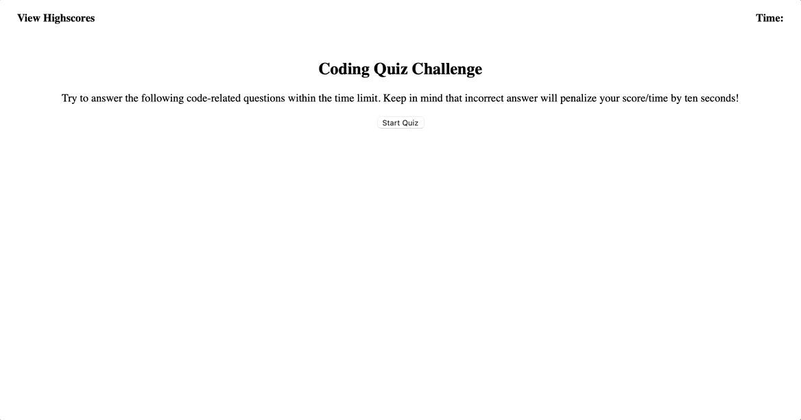

# coding-quiz
For this homework assignment, we had to create a coding quiz. If you got the question wrong, 10 seconds are docked off the timer. When you finish the quiz or run out of time, the quiz is completed, and the score is shown. You can input your initials to save your score, and there is a leaderboard that shows the highest scores. You can play again, or clear the leaderboard.

## Technologies Used
HTML/CSS and Javascript

## Application Functioning

Here is the link: [Coding Quiz Challenge](https://samyuhan.github.io/coding-quiz/)